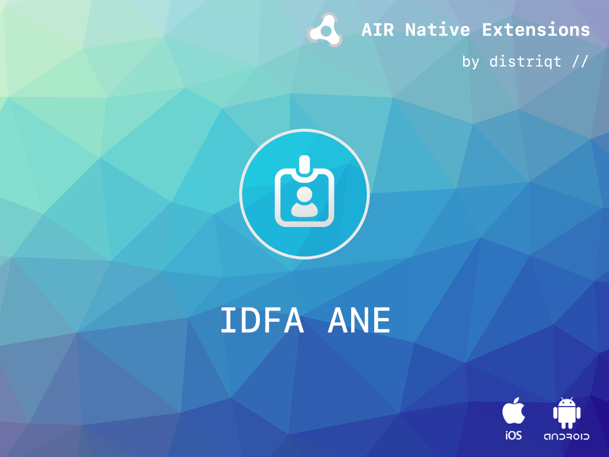

built by [distriqt //](https://airnativeextensions.com) 




# IDFA

The [IDFA](https://airnativeextensions.com/extension/com.distriqt.IDFA) extension 
gives you simple access to the advertising identifiers on Android and iOS.

#### Features

- Access the **identifier for advertising** on iOS;
- Access the **advertising Id** on Android;
- Single API interface - your code works across supported platforms with no modifications
- Sample project code and ASDocs reference


## Documentation

Latest documentation can be found in the [wiki](https://github.com/distriqt/ANE-IDFA/wiki)

Example: 

```actionscript
IDFA.service.addEventListener( IDFAEvent.COMPLETE, idfaCompleteHandler );
IDFA.service.getIDFA();

function idfaCompleteHandler( event:IDFAEvent ):void
{
    trace( "identifier: " + event.identifier );
}
```


