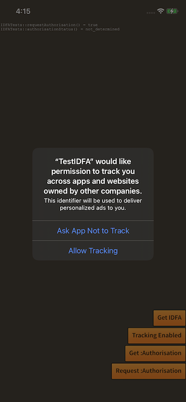

## Authorisation

iOS 14 introduced the App Tracking Transparency authorisation which requires applications to request permission to track a user.

You must have authorisation otherwise the IDFA will be invalid.


You can check what the current granted authorisation status is by calling the `authorisationStatus()` function. This will return one of the values defined in the `TrackingAuthorisationStatus` class:

```actionscript
var authorisationStatus:String = IDFA.service.authorisationStatus();
```

For example:

```actionscript
switch (IDFA.service.authorisationStatus())
{
    case TrackingAuthorisationStatus.NOT_DETERMINED:
        // Authorisation not yet requested
        break;

    case TrackingAuthorisationStatus.AUTHORISED:
        // Authorised to retrieve IDFA
        break; 

    case TrackingAuthorisationStatus.DENIED:
        // User has denied access
        break;

    case TrackingAuthorisationStatus.RESTRICTED:
        // Restricted usage
        break
}
```

>
> Note: On platforms that do not require user authorisation this will always return `AUTHORISED`
>

### Requesting Authorisation

You can request user authorisation by calling the `requestAuthorisation()` function. If possible, this will present a dialog to request permission from the user.




```actionscript
IDFA.service.requestAuthorisation();
```

This function will return `true` if the dialog will be presented and `false` in all other situations (eg the dialog has already been displayed or the platform does not require user authorisation). 


You handle feedback from this dialog either by listening for the `IDFAAuthorisationEvent.CHANGED` event or passing a callback function to the `requestAuthorisation()` function. The callback will always be called even if the dialog isn't presented whereas the event will only be dispatched if the dialog is presented (i.e. if `requestAuthorisation()` returns `true` ).

Using the callback:

```actionscript
IDFA.service.requestAuthorisation(
        function( authorisationStatus:String ):void
        {
            trace( status );
        }
);
```

Using the event:

```actionscript
IDFA.service.addEventListener( IDFAAuthorisationEvent.CHANGED, authorisationChangedHandler );
var success:Boolean = IDFA.service.requestAuthorisation();

function authorisationChangedHandler( event:IDFAAuthorisationEvent ):void
{
    trace( "authorisationChangedHandler: " + event.authorisationStatus );
}
```


## Advertising Identifier

The advertising identifier is a user-specific, unique, resettable ID for advertising, provided by Google Play services and the iOS SDK. It gives users better controls and provides developers with a simple, standard system to continue to monetize your apps. It is an anonymous identifier for advertising purposes and enables users to reset their identifier or opt out of interest-based ads within Google Play and iOS apps.

- **iOS**: this is the value of the `ASIdentifierManager` `advertisingIdentifier` property - <a href="http://developer.apple.com/documentation/adsupport/asidentifiermanager">documentation</a>
- **Android**: this is the value of the Google Play Services advertising ID - <a href="http://developers.google.com/android/reference/com/google/android/gms/ads/identifier/AdvertisingIdClient">documentation</a>.


The user has the ability to limit ad tracking on both iOS and Android through the device settings. This value can also be retrieved so that you can respect this value in any tracking your application performs.


Retrieving the advertising identifier or identifier for advertising (IDFA) is an asynchronous process.

You will need to call `getIDFA()` to start the call and listen for the `IDFAEvent.COMPLETE` event. This event contains the current advertisting identifier and whether the user has limited ad tracking.


```actionscript
IDFA.service.addEventListener( IDFAEvent.COMPLETE, idfaCompleteHandler );
IDFA.service.getIDFA();

function idfaCompleteHandler( event:IDFAEvent ):void
{
    trace( "identifier: " + event.identifier );
    trace( "isLimitAdTrackingEnabled: " + event.isLimitAdTrackingEnabled );
}
```


## Example

The following is a simple example of combining the authorisation request and IDFA retrieval:

```actionscript
IDFA.service.addEventListener( IDFAEvent.COMPLETE, idfaCompleteHandler );

IDFA.service.requestAuthorisation(
        function ( status:String ):void 
        {
            if (status == TrackingAuthorisationStatus.AUTHORISED)
            {
                IDFA.service.getIDFA();
            }
        }
);

function idfaCompleteHandler( event:IDFAEvent ):void
{
	trace( "identifier: " + event.identifier );
    trace( "isLimitAdTrackingEnabled: " + event.isLimitAdTrackingEnabled );
}
```


