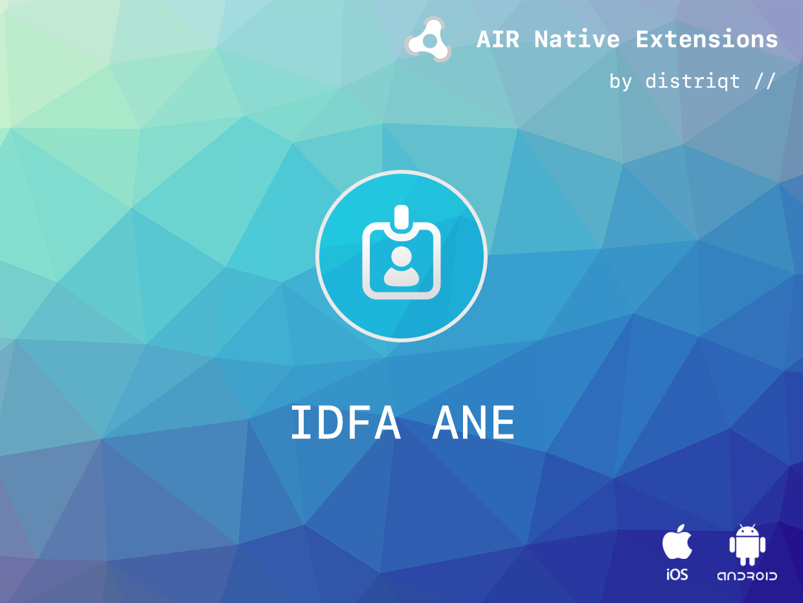

# IDFA

The [IDFA](https://airnativeextensions.com/extension/com.distriqt.IDFA) extension 
gives you simple access to the advertising identifiers on Android and iOS.

#### Features

- Access the **identifier for advertising** on iOS;
- Access the **advertising Id** on Android;
- Request authorisation using the App Tracking Transparency framework on iOS;
- Single API interface - your code works across supported platforms with no modifications
- Sample project code and ASDocs reference


## Documentation

The [wiki](https://github.com/distriqt/ANE-IDFA/wiki) forms the best source of detailed documentation for the extension along with 
the [asdocs](https://docs.airnativeextensions.com/asdocs/idfa). 


Example: 

```actionscript
IDFA.service.addEventListener( IDFAEvent.COMPLETE, idfaCompleteHandler );

IDFA.service.requestAuthorisation(
        function ( status:String ):void 
        {
            if (status == TrackingAuthorisationStatus.AUTHORISED)
            {
                IDFA.service.getIDFA();
            }
        }
);

function idfaCompleteHandler( event:IDFAEvent ):void
{
	trace( "identifier: " + event.identifier );
    trace( "isLimitAdTrackingEnabled: " + event.isLimitAdTrackingEnabled );
}
```


